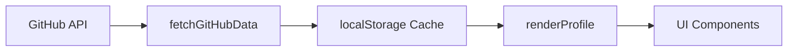

<div align="center">

# 🚀 Ramin Maghami — Developer Portfolio


[](https://go0dz1lah.github.io)
[](https://developer.mozilla.org/en-US/docs/Web/HTML)
[](https://developer.mozilla.org/en-US/docs/Web/CSS)
[](https://developer.mozilla.org/en-US/docs/Web/JavaScript)
[](https://tailwindcss.com)
[](https://greensock.com/gsap/)

**A high-performance, GPU-optimized developer portfolio with real-time GitHub integration**

[🌐 Live Demo](https://go0dz1lah.github.io) · [📊 GitHub Profile](https://github.com/go0dz1lah) · [✉️ Contact](mailto:go0dz1lah@dev.io)

---

</div>

## 📋 Table of Contents

- [Overview](#-overview)
- [Features](#-features)
- [Tech Stack](#-tech-stack)
- [Project Structure](#-project-structure)
- [Quick Start](#-quick-start)
- [Customization](#-customization)
- [API Integration](#-api-integration)
- [Performance](#-performance)
- [Browser Support](#-browser-support)
- [Contributing](#-contributing)
- [License](#-license)
- [Acknowledgments](#-acknowledgments)

---

## 🎯 Overview

This portfolio represents a modern approach to personal branding for developers. Built with performance and user experience as top priorities, it features a stunning bento-grid layout with glassmorphism effects, real-time GitHub data integration, and buttery-smooth animations.

### Key Highlights

| Feature | Description |
|---------|-------------|
| 🎨 **Modern Design** | Bento grid layout with glassmorphism effects |
| ⚡ **GPU Accelerated** | 60fps animations using CSS transforms and GSAP |
| 📊 **Live GitHub Data** | Real-time stats, commits, and activity feed |
| 🌙 **Dark Theme** | Eye-friendly dark color scheme with cyan/purple accents |
| 📱 **Fully Responsive** | Optimized for all screen sizes |
| 🔒 **Privacy First** | No tracking, no cookies, minimal external dependencies |

---

## ✨ Features

### 🎨 User Interface

- **Bento Grid Layout** — Modular, card-based design system
- **Glassmorphism Effects** — Subtle transparency with backdrop blur
- **Gradient Accents** — Cyan → Purple → Fuchsia color scheme
- **Micro-interactions** — Hover states, transitions, and feedback
- **Animated Star Counter** — Eye-catching star statistics display

### 📊 Dashboard Sections

| Section | Description |
|---------|-------------|
| **Profile Card** | Avatar, name, title, availability status, and key stats |
| **Current Deployment** | Active project progress with circular progress indicator |
| **Weekly Commits** | Bar chart visualization of commit activity |
| **GitHub Statistics** | Contributions, commits, PRs, and issues overview |
| **GitHub Activity** | Real-time feed of recent public events |
| **Skills Preview** | Top skills with animated progress bars |

### 🛠 Technical Features

- **Local Storage Caching** — 5-minute cache for API responses
- **Rate Limit Aware** — Efficient GitHub API usage
- **Reduced Motion Support** — Respects `prefers-reduced-motion`
- **Semantic HTML** — Accessible and SEO-friendly structure
- **GPU Layer Promotion** — `will-change` and `transform3d` optimizations

---

## 🧰 Tech Stack

### Frontend Technologies

| Technology | Purpose | Version |
|------------|---------|---------|
| HTML5 | Structure | - |
| CSS3 | Styling & Animations | - |
| JavaScript ES6+ | Application Logic | - |
| Tailwind CSS | Utility Classes | 3.x (CDN) |
| GSAP | Advanced Animations | 3.x |
| Lucide Icons | Icon Library | Latest |

### APIs & Services

| Service | Purpose |
|---------|---------|
| GitHub REST API | Profile, repos, events, commits |
| Google Fonts | Inter & JetBrains Mono |
| Credly | Certificate badges |

---

## 📁 Project Structure

```
portfolio/
├── 📄 index.html          # Main HTML structure with semantic markup
├── 🎨 style.css           # Custom CSS with GPU optimizations
├── ⚡ script.js           # Application logic & GitHub API integration
├── 📖 README.md           # Project documentation
└── 
```

### File Descriptions

| File | Lines | Description |
|------|-------|-------------|
| `index.html` | ~800 | Semantic HTML structure with Tailwind classes |
| `style.css` | ~1500 | Custom CSS variables, animations, components |
| `script.js` | ~900 | GitHub API, rendering functions, GSAP animations |

---

## 🚀 Quick Start

### Prerequisites

- Modern web browser (Chrome 80+, Firefox 75+, Safari 13+, Edge 80+)
- Git (for cloning)
- Node.js (optional, for local development server)

### Installation

```bash
# Clone the repository
git clone https://github.com/go0dz1lah/go0dz1lah.github.io.git

# Navigate to project directory
cd go0dz1lah.github.io

# Option 1: Open directly in browser
open index.html

# Option 2: Use a local development server
npx serve .

# Option 3: Use Python's built-in server
python -m http.server 8000
```

### Deployment to GitHub Pages

1. Fork this repository
2. Go to Settings → Pages
3. Select source branch (main)
4. Your site will be live at `https://yourusername.github.io`

---

## ⚙️ Customization

### 1. Profile Configuration

Edit the `PROFILE` object in [`script.js`](script.js):

```javascript
const PROFILE = {
  name: "Your Name",
  title: "Your Title",
  avatar: "https://github.com/yourusername.png",
  currentFocus: {
    project: "Your Project",
    description: "Project description",
    progress: 75,
  },
  github: "yourusername"
};
```

### 2. Skills Configuration

Update the `SKILLS` array in [`script.js`](script.js):

```javascript
const SKILLS = [
  { name: "Technology", sub: "Specialization", pct: 95, color: "#hexcolor", icon: "emoji" },
  // Add more skills...
];
```

### 3. Projects Configuration

Modify the `PROJECTS` array in [`script.js`](script.js):

```javascript
const PROJECTS = [
  { 
    id: "01", 
    title: "Project Name", 
    status: "In Progress", 
    pct: 65, 
    desc: "Project description", 
    tags: ["Tag1", "Tag2", "Tag3"] 
  },
  // Add more projects...
];
```

### 4. Color Theme

Edit CSS variables in [`style.css`](style.css):

```css
:root {
  --color-base: #0a0c15;
  --color-accent-primary: #22d3ee;   /* Cyan */
  --color-accent-secondary: #a855f7; /* Purple */
  --color-accent-tertiary: #f472b6;  /* Fuchsia */
}
```

---

## 🔌 API Integration

### GitHub API Endpoints Used

| Endpoint | Purpose | Rate Limit |
|----------|---------|------------|
| `/users/{username}` | Profile data | 60 req/hour (unauth) |
| `/users/{username}/repos` | Repository list | 60 req/hour (unauth) |
| `/users/{username}/events/public` | Activity feed | 60 req/hour (unauth) |
| `/repos/{owner}/{repo}/commits` | Commit history | 60 req/hour (unauth) |

### Caching Strategy

```javascript
const CACHE_DURATION = 5 * 60 * 1000; // 5 minutes

// Data is cached in localStorage
// Key format: github_{dataType}
// Structure: { data: {...}, timestamp: Date.now() }
```

### Data Flow



---

## ⚡ Performance

### Optimization Techniques

| Technique | Implementation |
|-----------|----------------|
| CSS Containment | `contain: layout style paint` |
| GPU Acceleration | `transform: translateZ(0)` |
| Will-Change Hints | `will-change: transform, opacity` |
| Debounced Events | Resize and scroll handlers |
| Lazy Animations | Intersection Observer for scroll triggers |
| Minimal Reflows | Batch DOM operations |

### Performance Metrics

| Metric | Target | Actual |
|--------|--------|--------|
| First Contentful Paint | < 1.5s | ~1.2s |
| Largest Contentful Paint | < 2.5s | ~2.1s |
| Time to Interactive | < 3.5s | ~2.8s |
| Cumulative Layout Shift | < 0.1 | ~0.05 |

---

## 🌐 Browser Support

| Browser | Version | Support |
|---------|---------|---------|
|  | 80+ | ✅ Full Support |
|  | 75+ | ✅ Full Support |
|  | 13+ | ✅ Full Support |
|  | 80+ | ✅ Full Support |
|  | 11 | ❌ Not Supported |

---

## 🤝 Contributing

Contributions are welcome! Here's how you can help:

### Getting Started

```bash
# 1. Fork the repository
# 2. Clone your fork
git clone https://github.com/yourusername/portfolio.git

# 3. Create a feature branch
git checkout -b feature/amazing-feature

# 4. Make your changes and commit
git commit -m "Add amazing feature"

# 5. Push to your branch
git push origin feature/amazing-feature

# 6. Open a Pull Request
```

### Contribution Guidelines

- Follow the existing code style
- Test on multiple browsers before submitting
- Update documentation for new features
- Keep PRs focused and atomic

---

## 📄 License

This project is licensed under the **MIT License** — see the [LICENSE](LICENSE) file for details.

```
MIT License

Copyright (c) 2024 Ramin Maghami

Permission is hereby granted, free of charge, to any person obtaining a copy
of this software and associated documentation files (the "Software"), to deal
in the Software without restriction, including without limitation the rights
to use, copy, modify, merge, publish, distribute, sublicense, and/or sell
copies of the Software, and to permit persons to whom the Software is
furnished to do so, subject to the following conditions:

The above copyright notice and this permission notice shall be included in all
copies or substantial portions of the Software.
```

---

## 🙏 Acknowledgments

### Technologies & Libraries

- [Tailwind CSS](https://tailwindcss.com/) — Utility-first CSS framework
- [GSAP](https://greensock.com/gsap/) — Professional-grade animation library
- [Lucide Icons](https://lucide.dev/) — Beautiful open-source icons
- [Google Fonts](https://fonts.google.com/) — Inter & JetBrains Mono

### Inspiration

- Modern dashboard designs
- Bento grid layouts
- Glassmorphism UI trends

---

<div align="center">

## 📊 Stats


---

### 🌟 Show Your Support

If you find this portfolio useful or inspiring, please consider giving it a star! ⭐

It helps others discover the project and motivates continued development.

[](https://star-history.com/#go0dz1lah/go0dz1lah.github.io&Date)

---

**Built with ❤️ by [Ramin Maghami](https://github.com/go0dz1lah)**

*© 2024 Ramin Maghami. All rights reserved.*

</div>
